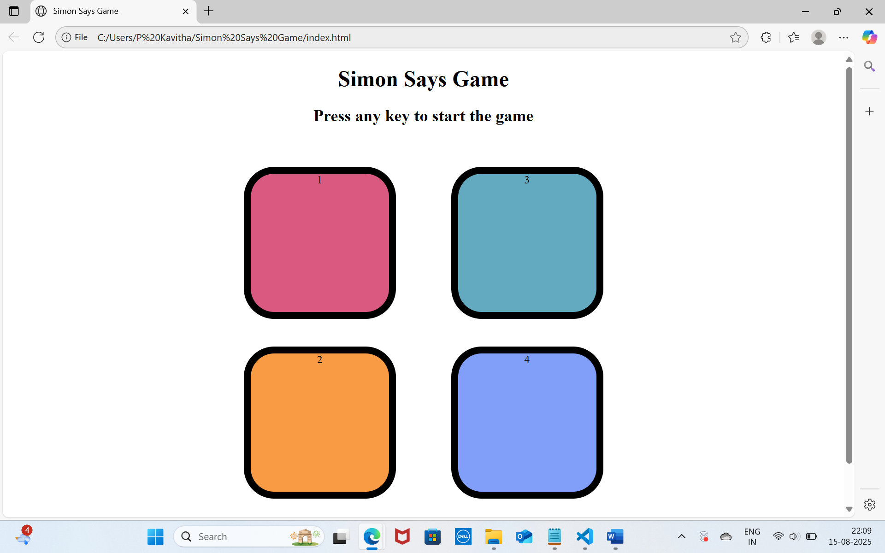

# Simon-Says-Game
# 🎮 Simon Says Game

A simple and interactive **Simon Says** game built using **HTML, CSS, and JavaScript**.  
Test your memory by repeating the color sequence shown by the game. The sequence grows with each correct attempt — see how far you can go! 🚀

---

## 📌 Features
- **Random sequence generation** for each round
- **Four colorful buttons** (Red, Yellow, Green, Purple)
- **Keyboard start** — Press any key to start the game
- **Score tracking** — Try to beat your high score!
- **Game over feedback** when you make a mistake

---

## 🛠️ Tech Stack
- **HTML5** — Structure
- **CSS3** — Styling and button effects
- **JavaScript (ES6)** — Game logic and interactions

---

## 🚀 How to Play
1. Open the game in your browser.
2. Press any key to **start**.
3. Watch the sequence of colors that flashes.
4. Click the buttons in the **exact same order**.
5. Each round, the sequence will get longer.
6. Keep going until you make a mistake — then the game resets.

---

## 📂 Project Structure
index.html  # The game page
style.css   # Colors and styling
script.js   # Game logic
README.md   # This file

---

## 📖 My Learning Experience
Building this project was actually super fun.  
The hardest part was syncing the flashing colors with proper delays — I had to figure out `setTimeout` usage correctly.  
At first, my game skipped colors unexpectedly, but after debugging, it now works smoothly.  
This project really helped me understand DOM events and timing in JavaScript.

---

## 📸 Screenshot

---

## 💡 Future Plans
- Add **sound effects** for each color
- Store **high scores** in local storage
- Add a **hardcore mode** where colors shuffle positions every round

---

## 🌐 Play It Here

